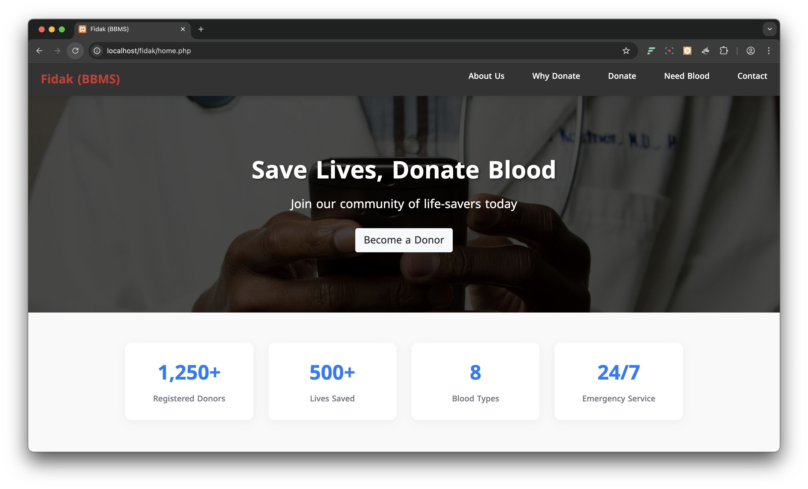
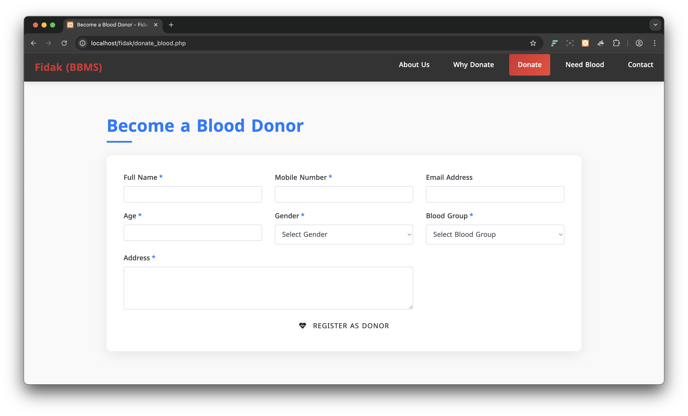
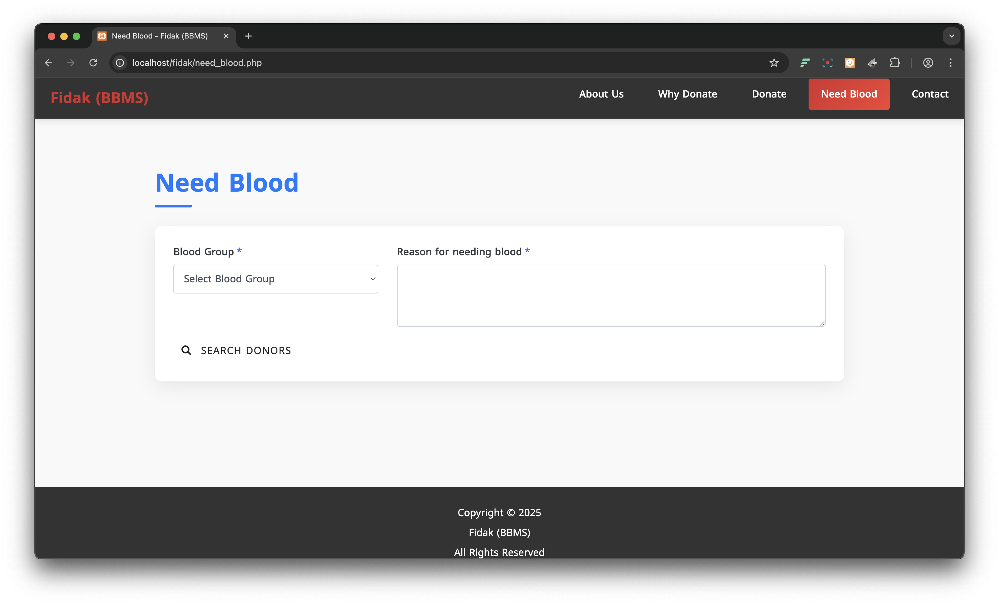
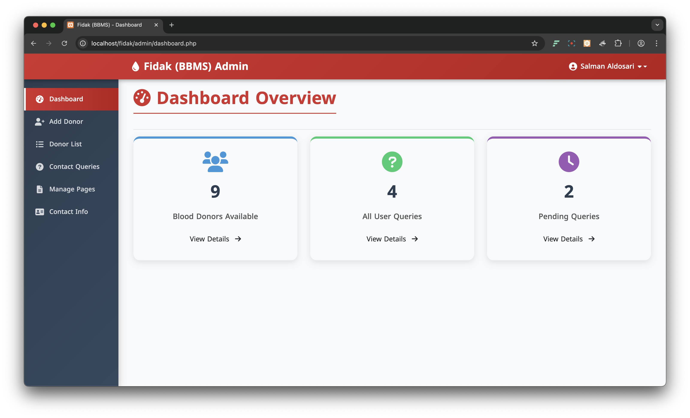
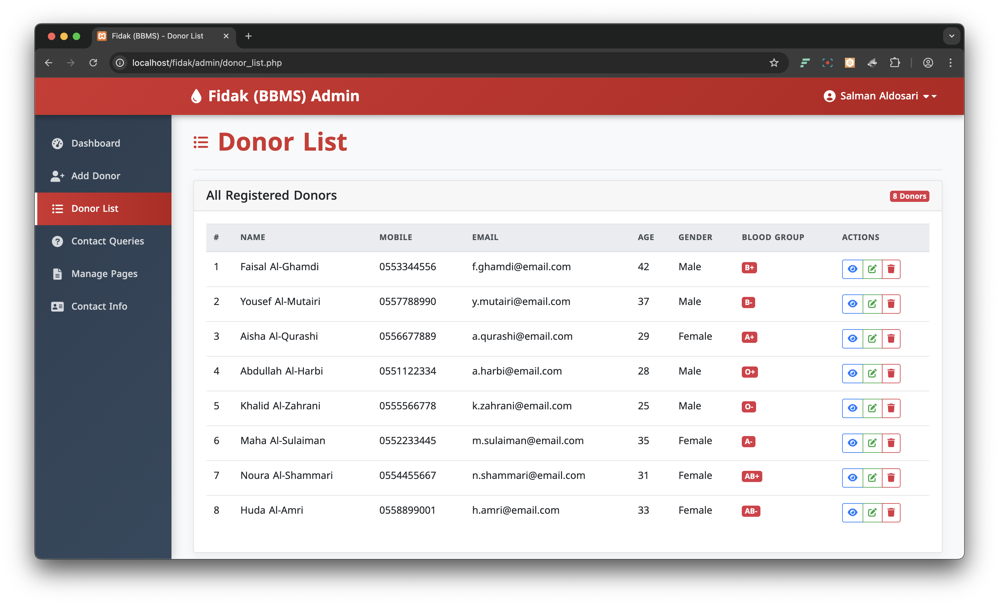
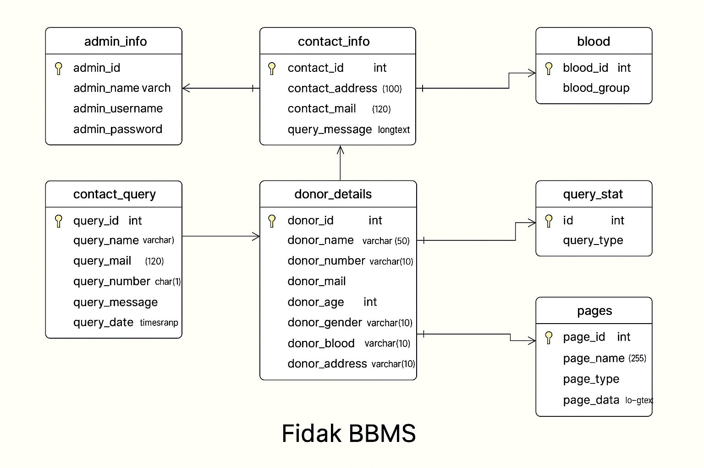

# Fidak – Saudi Blood Donation Management System

Fidak is a web-based blood donation management system designed to support blood donation operations in Saudi Arabia. The system allows donors to register, users to request blood, and administrators to manage donors, requests, website content, and contact queries through an admin dashboard.

**PHP · MySQL · Bootstrap · JavaScript**

[Preview](#screenshots) · [Local setup](#local-setup) · [Database](#database)

## Project Overview

The goal of Fidak is to make blood donation management easier, faster, and more organized. Donors can register their information, users can search for needed blood groups, and admins can manage system data through full CRUD operations.

This project was developed as a final project for CS2111.

## Features

- Donor registration form
- Blood request form
- Blood group search and filtering
- Admin login system
- Admin dashboard overview
- Add, view, update, and delete donor records
- Manage contact queries
- Manage website page content
- Basic form validation
- Responsive web design
- Database-driven system using MySQL

## Tech Stack

- HTML
- CSS
- Bootstrap 3.4.1
- JavaScript
- jQuery 3.5.1
- PHP
- MySQL

## Screenshots

### Home Page


### Become a Donor


### Need Blood


### Admin Dashboard


### Donor List


### Database Diagram


## Database

The system includes tables for donors, blood groups, admin information, contact queries, pages, and query status.

Main database operations include:

- Create: adding donors, contact queries, and blood requests
- Read: displaying donor lists, search results, and user queries
- Update: editing page content, contact information, and admin password
- Delete: removing donors and contact queries

## Local setup

1. Install a local PHP/MySQL environment such as XAMPP and start the web server and MySQL.
2. Clone this repository into your web server's document root:
   `git clone https://github.com/iiYARA/fidak-blood-donation-management-system.git`
3. Create a local database named `fidak_bbms` and import [sql/fidak_bbms_db.sql](sql/fidak_bbms_db.sql).
4. Adjust database connection settings in [conn.php](conn.php) and [admin/conn.php](admin/conn.php) for your local environment.
5. Open `http://localhost/fidak-blood-donation-management-system/home.php`.

The database connections currently target a local MySQL instance. This is an academic prototype; use sample data for local demonstrations.

## Demo admin access

For the supplied demo database, the documented login is:

```text
Username: admin
Password: 123456
```

Use these only for a local demonstration, and change demo credentials before any deployment.


